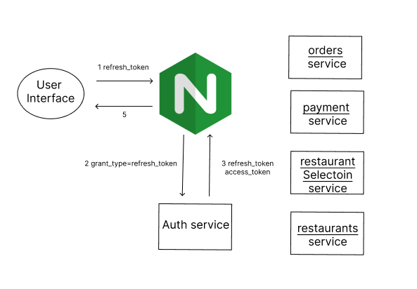

# Food Delivery Systems

Food delivery systems built with Microservices Architecture using gRPC for service-to-service communication.

## Installation

1. Clone this repository:

        git clone https://github.com/zhosyaaa/foodDeliverySystems

2. Navigate to the project root directory:

         cd simple-ecommerce-microservices-grpc

3. Run the start script:

         chmod u+x ./start.sh
         ./start.sh

4. The API is now running on `localhost:3000`.

5. To stop the app, simply use Docker Compose:

         docker-compose down

## Routes

**Authentication: JWT as OAuth 2.0**

| HTTP Method | Route               | Description             |
|-------------|---------------------|-------------------------|
| POST        | /auth/register      | Register user           |
| POST        | /auth/login         | Login user              |
| GET         | /product            | List products (requires authentication) |
| GET         | /product/{product_id} | Get product by ID (requires authentication) |
| POST        | /product            | Create product (requires authentication) |
| POST        | /order              | Create order (requires authentication) |

## Design

Backend high-level design

